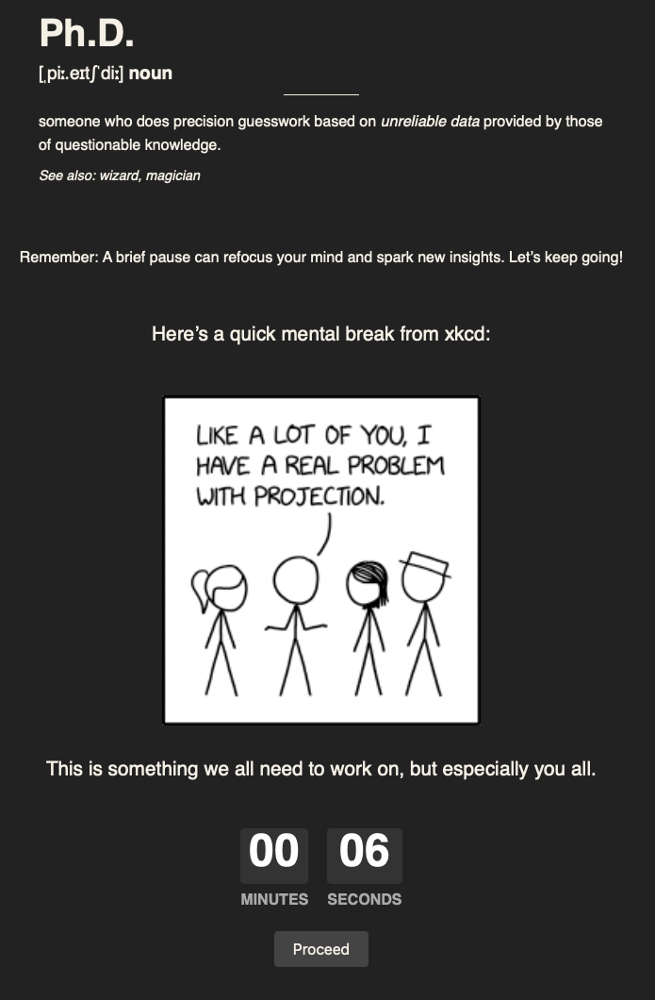

# PhD Focus Extension

This extension helps you stay focused by **delaying** access to websites you find distracting. When you visit a blocked site, it displays a random xkcd comic and a **flip clock** countdown. Once time is up, you regain access to the page.

---

## Popup Overview

Here’s how the popup looks:

1. **Enable Extension**: Globally turn the extension on or off.  
2. **Delay current site**: While on a site you want to block, check this box.  
3. **Delay (seconds)**: Adjust the countdown duration (default: 30).  
4. **Delayed Websites**: Shows all sites you’ve chosen to delay. Click the **×** to remove any domain.

---

## Overlay & Countdown

When you visit a delayed website, you’ll see:

1. **Mindful moment heading**: Encourages you to pause.  
2. **Random xkcd comic**: A quick mental break.  
3. **Flip clock**: Counts down the remaining delay. After it hits 0, the overlay disappears and you can use the site.

---

## Installation

1. **Safari** (Xcode project):  
   - Open the project in Xcode and build/run.  
   - In Safari → Settings → Extensions, enable “PhD Focus Extension” and grant permission for all sites.  
2. **Chrome / Edge / Firefox**:  
   - Go to your browser’s “Extensions” page.  
   - Choose “Load Unpacked Extension” (or similar) and select the folder containing `manifest.json`.

---

## Usage

1. **Toggle On**: In the popup, enable the extension.  
2. **Block a Domain**: Check “Delay current site” while on a distracting site.  
3. **Set Delay**: Adjust “Delay (seconds)” to your preferred waiting time.  
4. **Open a Blocked Site**: The overlay will appear with an xkcd comic and a countdown.  
5. **Focus**: Once time’s up, the overlay goes away, letting you access the site.

---

## Contributing

- **Bug Reports & Feature Requests**: Submit issues or pull requests on GitHub.  
- **Code Style**: Use consistent formatting.  
- **License**: [MIT](https://opensource.org/licenses/MIT)

---

Enjoy fewer distractions and mindful breaks with the **PhD Focus Extension**!